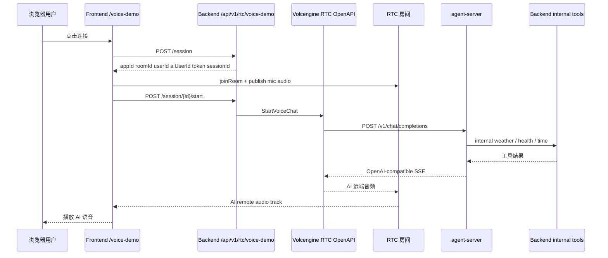

# 火山引擎 RTC 语音 Agent Demo 接入实现说明

## 1. 这次到底做了什么

这次不是单独做一个新项目，而是在现有 `AgentProject` 上补了一条完整的语音对话链路，让主站用户登录后可以进入 `/voice-demo` 页面，通过火山 RTC 房间、后端控制面和独立 `agent-server` 完成一轮真实语音问答。

最终落地后的能力包括：

1. 主站后端新增 RTC session 控制面。
2. 主站前端新增 `/voice-demo` 页面和账户页入口。
3. 新增独立部署的 `agent-server/`，对火山侧暴露 OpenAI-compatible `/v1/chat/completions`。
4. 新增内部工具链：
   - 当前时间
   - 平台状态
   - 真实天气查询
5. 完成部署链路：
   - `agent-server` 独立 compose
   - 主站 Nginx `/agent/*` 反代
   - HTTPS
6. 修掉了真实联调中出现的几类关键问题：
   - 错误 AppId
   - `StartVoiceChat` 请求体格式错误
   - `agent-server` 工具关键词编码损坏
   - 天气工具最初只是 stub，没有真实数据源

---

## 2. 为什么是这种接法

原项目已经有三块可复用能力：

1. 主站后端已经有用户体系和登录鉴权。
2. 主站前端已经有账户页、受保护路由和统一 API client。
3. 项目已经有现成的 Docker / Nginx / CI-CD 结构。

所以没有把语音功能塞成一堆散落脚本，而是按下面这个边界接入：

### 2.1 后端继续做“控制面”

主站后端负责：

- 创建 RTC session
- 生成 RTC token
- 调火山 `StartVoiceChat / UpdateVoiceChat / StopVoiceChat`
- 管理 session 生命周期
- 提供内部工具接口给 `agent-server`

这样做的原因很直接：

- 主站后端已经有用户身份，不需要重新发明一套登录。
- 不能把 `BACKEND_INTERNAL_API_KEY` 和火山控制参数下发到浏览器。
- session 生命周期、清理、幂等处理更适合放在服务端。

### 2.2 `agent-server` 独立部署

`agent-server` 没有并进主站后端，而是单独放在顶层 [agent-server/](</D:/PersonalSpace/AgentProject/agent-server>)。

原因：

- 火山侧“第三方大模型 / Agent”需要一个独立、稳定、OpenAI-compatible 的 HTTP 入口。
- 语音 Agent 的工具路由逻辑、SSE 输出和主站业务 API 不属于同一职责。
- 独立部署后更容易横向替换工具逻辑或升级成更复杂的 agent。

### 2.3 前端只做 RTC 房间侧体验

浏览器端只负责：

- 点连接
- 申请麦克风权限
- 进 RTC 房间
- 发布本地音频
- 订阅 AI 远端音频
- 打断 / 静音 / 挂断 / 重连

浏览器不直接碰：

- 火山 OpenAPI 凭证
- `BACKEND_INTERNAL_API_KEY`
- 工具调用细节

这符合当前项目现有的安全边界。

---

## 3. 原项目基础上新增了哪些模块

## 3.1 后端

### 3.1.1 RTC 路由挂载

主路由在 [backend/app/api/router.py](</D:/PersonalSpace/AgentProject/backend/app/api/router.py>) 中新增了：

- `rtc.router`

最终接口挂在：

- `/api/v1/rtc/voice-demo/*`

### 3.1.2 RTC API

核心接口在 [backend/app/api/v1/rtc.py](</D:/PersonalSpace/AgentProject/backend/app/api/v1/rtc.py>)：

- `POST /session`
- `POST /session/{session_id}/start`
- `GET /session/{session_id}`
- `POST /session/{session_id}/interrupt`
- `POST /session/{session_id}/stop`

这些接口全部复用现有登录态：

- `Depends(get_current_user)`

没有新造一套用户鉴权。

### 3.1.3 RTC schema / service / store / token

相关文件：

- [backend/app/schemas/rtc.py](</D:/PersonalSpace/AgentProject/backend/app/schemas/rtc.py>)
- [backend/app/services/rtc/service.py](</D:/PersonalSpace/AgentProject/backend/app/services/rtc/service.py>)
- [backend/app/services/rtc/store.py](</D:/PersonalSpace/AgentProject/backend/app/services/rtc/store.py>)
- [backend/app/services/rtc/token.py](</D:/PersonalSpace/AgentProject/backend/app/services/rtc/token.py>)

职责拆分如下：

- `schemas/rtc.py`
  - 定义响应结构
  - 使用 `sessionActive + state`
  - 不向前端暴露 `taskId`

- `store.py`
  - 进程内存 session store
  - 记录 `creating / active / stopping / stopped / expired / stop_pending / cleanup_failed / failed`

- `token.py`
  - 生成 RTC token

- `service.py`
  - 真正调用火山 RTC OpenAPI
  - 维护 session 生命周期
  - 实现 cleanup worker
  - 处理 stop / interrupt 幂等

### 3.1.4 cleanup worker 的实现

之前最容易出问题的是过期 session 清理。

最终实现不是递归，而是：

- `while` 循环
- `shutdown event`
- 每轮扫描过期或待清理 session
- best-effort 调 `StopVoiceChat`
- 异常只记日志，不杀主进程

这部分逻辑在 [backend/app/services/rtc/service.py](</D:/PersonalSpace/AgentProject/backend/app/services/rtc/service.py>) 中。

### 3.1.5 `/tools/weather` 和内部工具接口

天气接口在 [backend/app/api/v1/tools.py](</D:/PersonalSpace/AgentProject/backend/app/api/v1/tools.py>)。

保留了原有兼容路径：

- `GET /api/v1/tools/weather`

同时新增服务间调用路径：

- `GET /api/v1/tools/internal/weather`

内部接口使用：

- `X-Internal-Api-Key`

这样浏览器不用持有内部 key，但 `agent-server` 可以用服务间鉴权访问工具。

### 3.1.6 真实天气实现

最开始天气工具只是一个 stub，固定返回 Sunny / 25°C。

后来补成了真实天气查询，核心文件是：

- [backend/app/services/tools/weather.py](</D:/PersonalSpace/AgentProject/backend/app/services/tools/weather.py>)

当前实现：

1. 先调用 Open-Meteo Geocoding API，把城市名解析成经纬度。
2. 再调用 Open-Meteo Forecast API 拉取：
   - 当前气温
   - 体感温度
   - 湿度
   - 风速
   - 天气代码
   - 当日最高最低温
3. 把 WMO `weather_code` 转成人类可读中文描述。

这样 `agent-server` 不用改协议，直接消费后端 JSON 即可。

### 3.1.7 配置与依赖

配置主要落在：

- [backend/app/core/config.py](</D:/PersonalSpace/AgentProject/backend/app/core/config.py>)
- [backend/.env.example](</D:/PersonalSpace/AgentProject/backend/.env.example>)
- [backend/requirements.txt](</D:/PersonalSpace/AgentProject/backend/requirements.txt>)

新增了 RTC / agent 相关环境变量，例如：

- `VOLC_AI_RTC_APP_ID`
- `VOLC_AI_RTC_APP_KEY`
- `VOLC_OPENAPI_AK`
- `VOLC_OPENAPI_SK`
- `VOLC_AGENT_CHAT_COMPLETIONS_URL`
- `VOLC_AGENT_API_KEY`
- `BACKEND_INTERNAL_API_KEY`

---

## 3.2 agent-server

`agent-server` 是这次新增的独立服务，目录在 [agent-server/](</D:/PersonalSpace/AgentProject/agent-server>)。

### 3.2.1 为什么需要它

火山 AI 音视频互动方案在“第三方大模型 / Agent”模式下，需要一个对外可访问的模型/Agent HTTP 入口。

这个入口需要：

- Bearer 鉴权
- OpenAI-compatible 请求结构
- 支持 `stream=true`
- 返回 SSE
- 最终输出 `data: [DONE]`

主站后端不适合直接兼做这个角色，所以单独拆成了 `agent-server`。

### 3.2.2 入口接口

在 [agent-server/app/main.py](</D:/PersonalSpace/AgentProject/agent-server/app/main.py>)：

- `GET /health`
- `POST /v1/chat/completions`

### 3.2.3 OpenAI-compatible 输出

`/v1/chat/completions` 支持两种模式：

1. `stream=false`
   - 返回标准 `chat.completion`
2. `stream=true`
   - 返回 `text/event-stream`
   - chunk object 为 `chat.completion.chunk`
   - 内容放在 `delta.content`
   - 最后输出 `data: [DONE]`

### 3.2.4 工具路由

核心逻辑在 [agent-server/app/agent.py](</D:/PersonalSpace/AgentProject/agent-server/app/agent.py>)。

当前是一个轻量 LangGraph 路由器，不是全通用大模型代理。

它根据用户问题分流到三类工具：

- 时间
- 天气
- 平台状态

为什么这样做：

- 当前 Demo 的目标是让语音链路稳定跑通
- 工具集合小且明确
- 用规则路由比再套一层 LLM 工具规划更可控

### 3.2.5 工具实现

工具客户端在 [agent-server/app/tools.py](</D:/PersonalSpace/AgentProject/agent-server/app/tools.py>)。

实现如下：

- `get_current_time`
  - 直接返回服务器当前北京时间

- `get_demo_weather`
  - 调主站后端 `/api/v1/tools/internal/weather`
  - 头里带 `X-Internal-Api-Key`

- `get_platform_status`
  - 调主站后端 `/health/ready`

### 3.2.6 城市透传

后来补了一层天气城市识别。

现在：

- `今天天气怎么样`
  - 默认查 Beijing
- `上海天气怎么样`
  - 会把 `上海` 透传给后端天气接口

这部分也在 [agent-server/app/agent.py](</D:/PersonalSpace/AgentProject/agent-server/app/agent.py>) 里。

---

## 3.3 前端

### 3.3.1 页面入口

账户页新增了语音入口卡片：

- [frontend/src/pages/Account.tsx](</D:/PersonalSpace/AgentProject/frontend/src/pages/Account.tsx>)

新增受保护页面：

- `/voice-demo`

对应页面：

- [frontend/src/pages/VoiceDemoPage.tsx](</D:/PersonalSpace/AgentProject/frontend/src/pages/VoiceDemoPage.tsx>)

### 3.3.2 前端 API client

文件：

- [frontend/src/services/voiceDemo.ts](</D:/PersonalSpace/AgentProject/frontend/src/services/voiceDemo.ts>)

封装了：

- `createVoiceDemoSession`
- `startVoiceDemoSession`
- `getVoiceDemoSession`
- `interruptVoiceDemoSession`
- `stopVoiceDemoSession`

这样前端页面不直接拼 URL。

### 3.3.3 RTC 适配层

文件：

- [frontend/src/lib/voiceRtc.ts](</D:/PersonalSpace/AgentProject/frontend/src/lib/voiceRtc.ts>)

它做了几件事：

1. 用 `@volcengine/rtc` 创建 engine。
2. `joinRoom`
3. `startAudioCapture`
4. `publishStream(MediaType.AUDIO)`
5. 只订阅 `aiUserId` 的远端音频
6. 把 AI 远端音轨挂到页面上的 `<audio>`

这里做成单独适配层，而不是把 SDK 调用写死在页面里，原因是：

- 后续更换 SDK 事件或修补浏览器兼容更方便
- 页面逻辑和 RTC SDK 细节解耦

### 3.3.4 页面状态机

页面内部维护的核心 phase 大致是：

- `idle`
- `creating_session`
- `joining_room`
- `connected`
- `interrupting`
- `stopping`
- `stopped`
- `error`

实际逻辑都在 [frontend/src/pages/VoiceDemoPage.tsx](</D:/PersonalSpace/AgentProject/frontend/src/pages/VoiceDemoPage.tsx>)。

页面还处理了几类关键问题：

1. 非 HTTPS 禁止公网连接
2. 先检查麦克风权限
3. 防止重复点击连接
4. 关闭页面时 `keepalive stop`
5. 静音不等于 leave room
6. 记录简要事件日志

---

## 4. 关键请求链路

下面是最终稳定版本的调用链：



---

## 5. 实际联调中遇到的问题和处理

## 5.1 旧 AppId 不是 AI Agent 类型

早期联调报错：

- `NoPermissionForApp: appid ... is not ai agent type`

根因不是代码，而是配置里用的是普通 RTC 应用，不是 AI 音视频互动方案专属应用。

最终切换成可用的 AI 方案应用后，`StartVoiceChat` 才真正通过。

## 5.2 `StartVoiceChat` 请求体不能 flatten

一开始请求体被 flatten 成点号结构，导致火山返回误导性错误：

- `invalid UserID in AgentConfig`

后来在 [backend/app/services/rtc/service.py](</D:/PersonalSpace/AgentProject/backend/app/services/rtc/service.py>) 中改成：

- 直接发送原始 JSON body

这才拿到了真实错误并最终跑通。

## 5.3 `agent-server` 中文路由编码损坏

之前工具路由的中文关键词全变成了乱码，结果是：

- 工具几乎永远不命中
- 看起来像语音能通，但工具不会调

后来重写了：

- [agent-server/app/agent.py](</D:/PersonalSpace/AgentProject/agent-server/app/agent.py>)
- [agent-server/app/tools.py](</D:/PersonalSpace/AgentProject/agent-server/app/tools.py>)
- [agent-server/app/main.py](</D:/PersonalSpace/AgentProject/agent-server/app/main.py>)

把中文关键词和自然语言降级文案全部恢复成 UTF-8 正常文本。

## 5.4 天气最初只是 demo stub

最开始天气工具返回固定值：

- Sunny
- 25°C

后来接成了 Open-Meteo 的真实天气查询，才变成可用工具。

## 5.5 HTTPS 是浏览器语音链路的硬前提

公网浏览器访问麦克风和 RTC，必须有 HTTPS 或 localhost。

因此最终又补了：

- 服务器证书
- Nginx `443`
- `/agent/*` SSE 反代

---

## 6. 这次新增/重点改动的核心文件

### 后端

- [backend/app/api/router.py](</D:/PersonalSpace/AgentProject/backend/app/api/router.py>)
- [backend/app/api/v1/rtc.py](</D:/PersonalSpace/AgentProject/backend/app/api/v1/rtc.py>)
- [backend/app/api/v1/tools.py](</D:/PersonalSpace/AgentProject/backend/app/api/v1/tools.py>)
- [backend/app/schemas/rtc.py](</D:/PersonalSpace/AgentProject/backend/app/schemas/rtc.py>)
- [backend/app/services/rtc/service.py](</D:/PersonalSpace/AgentProject/backend/app/services/rtc/service.py>)
- [backend/app/services/rtc/store.py](</D:/PersonalSpace/AgentProject/backend/app/services/rtc/store.py>)
- [backend/app/services/rtc/token.py](</D:/PersonalSpace/AgentProject/backend/app/services/rtc/token.py>)
- [backend/app/services/tools/weather.py](</D:/PersonalSpace/AgentProject/backend/app/services/tools/weather.py>)
- [backend/app/core/config.py](</D:/PersonalSpace/AgentProject/backend/app/core/config.py>)
- [backend/app/core/security.py](</D:/PersonalSpace/AgentProject/backend/app/core/security.py>)
- [backend/app/main.py](</D:/PersonalSpace/AgentProject/backend/app/main.py>)

### agent-server

- [agent-server/app/main.py](</D:/PersonalSpace/AgentProject/agent-server/app/main.py>)
- [agent-server/app/agent.py](</D:/PersonalSpace/AgentProject/agent-server/app/agent.py>)
- [agent-server/app/tools.py](</D:/PersonalSpace/AgentProject/agent-server/app/tools.py>)
- [agent-server/app/auth.py](</D:/PersonalSpace/AgentProject/agent-server/app/auth.py>)
- [agent-server/app/config.py](</D:/PersonalSpace/AgentProject/agent-server/app/config.py>)
- [agent-server/app/schemas.py](</D:/PersonalSpace/AgentProject/agent-server/app/schemas.py>)

### 前端

- [frontend/src/pages/VoiceDemoPage.tsx](</D:/PersonalSpace/AgentProject/frontend/src/pages/VoiceDemoPage.tsx>)
- [frontend/src/pages/Account.tsx](</D:/PersonalSpace/AgentProject/frontend/src/pages/Account.tsx>)
- [frontend/src/services/voiceDemo.ts](</D:/PersonalSpace/AgentProject/frontend/src/services/voiceDemo.ts>)
- [frontend/src/lib/voiceRtc.ts](</D:/PersonalSpace/AgentProject/frontend/src/lib/voiceRtc.ts>)

### 部署与文档

- [docker-compose.yml](</D:/PersonalSpace/AgentProject/docker-compose.yml>)
- [deploy/nginx.conf](</D:/PersonalSpace/AgentProject/deploy/nginx.conf>)
- [deploy/deploy.sh](</D:/PersonalSpace/AgentProject/deploy/deploy.sh>)
- [agent-server/docker-compose.yml](</D:/PersonalSpace/AgentProject/agent-server/docker-compose.yml>)
- [docs/VOICE_DEMO_SETUP.md](</D:/PersonalSpace/AgentProject/docs/VOICE_DEMO_SETUP.md>)

---

## 7. 测试与验证

这次实际跑过的验证包括：

### 后端

```bash
cd backend
venv/Scripts/python.exe -m compileall app
venv/Scripts/python.exe -m pytest -q -p no:cacheprovider tests
```

### agent-server

```bash
cd agent-server
.venv/Scripts/python.exe -m compileall app
.venv/Scripts/python.exe -m pytest -q -p no:cacheprovider
```

### 线上联调

已验证：

1. `https://detachym.top/health`
2. `https://detachym.top/agent/health`
3. `StartVoiceChat` 能启动
4. `/voice-demo` 能进房、发麦、收 AI 音频
5. `现在几点了` 命中时间工具
6. `平台现在正常吗` 命中平台状态工具
7. `今天天气怎么样` 命中真实天气工具
8. `上海天气怎么样` 能透传城市名并返回真实天气

---

## 8. 如果以后要继续扩展，应该怎么加

### 8.1 加新工具

最稳妥的方式是延续现有结构：

1. 在主站后端新增内部工具接口
   - 例如 `/api/v1/tools/internal/news`
2. 在 `agent-server/app/tools.py` 增加一个对应工具函数
3. 在 `agent-server/app/agent.py` 增加路由规则
4. 增加对应测试

不要让浏览器直接调工具接口，也不要把内部 key 放到前端。

### 8.2 替换天气数据源

如果后面要从 Open-Meteo 切到别的天气服务：

1. 保持 [backend/app/api/v1/tools.py](</D:/PersonalSpace/AgentProject/backend/app/api/v1/tools.py>) 的响应结构尽量不变
2. 只替换 [backend/app/services/tools/weather.py](</D:/PersonalSpace/AgentProject/backend/app/services/tools/weather.py>)
3. `agent-server` 基本不用动

### 8.3 多实例部署

当前 RTC session store 是进程内存。

如果后面主站后端变成：

- 多 worker
- 多实例
- 自动扩缩容

那么 [backend/app/services/rtc/store.py](</D:/PersonalSpace/AgentProject/backend/app/services/rtc/store.py>) 需要改成 Redis 之类的共享存储。

---

## 9. 当前已知限制

1. RTC session store 还是内存态，不适合多实例共享。
2. `agent-server` 当前是规则路由，不是全通用智能体框架。
3. 天气工具已经是真实数据，但当前没有做更复杂的中文地名归一化。
4. 语音链路稳定性仍然依赖火山侧 AI 应用、TTS/ASR 配置和公网 HTTPS。

---

## 10. 一句话总结

这次接入不是“加一个页面”这么简单，而是在原项目现有登录、前后端 API、Docker 和 Nginx 基础上，补齐了一条完整的“浏览器 -> 主站后端控制面 -> 火山 RTC -> 独立 agent-server -> 内部工具 -> AI 语音回房”的闭环链路，并且已经跑通了真实天气、时间和平台状态工具。
